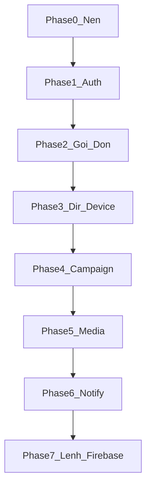
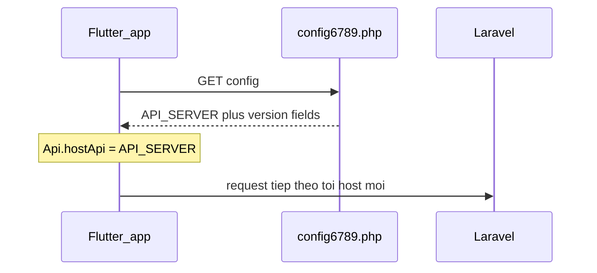
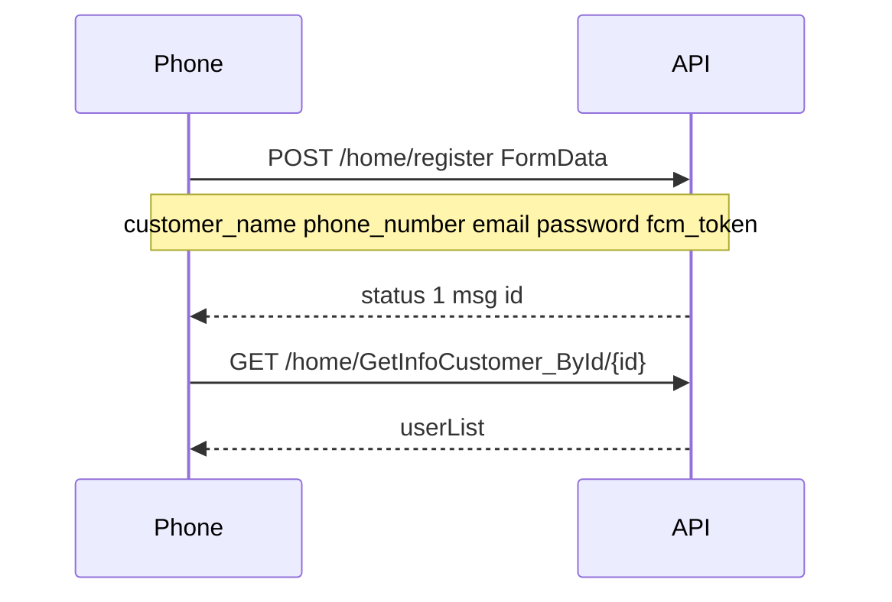
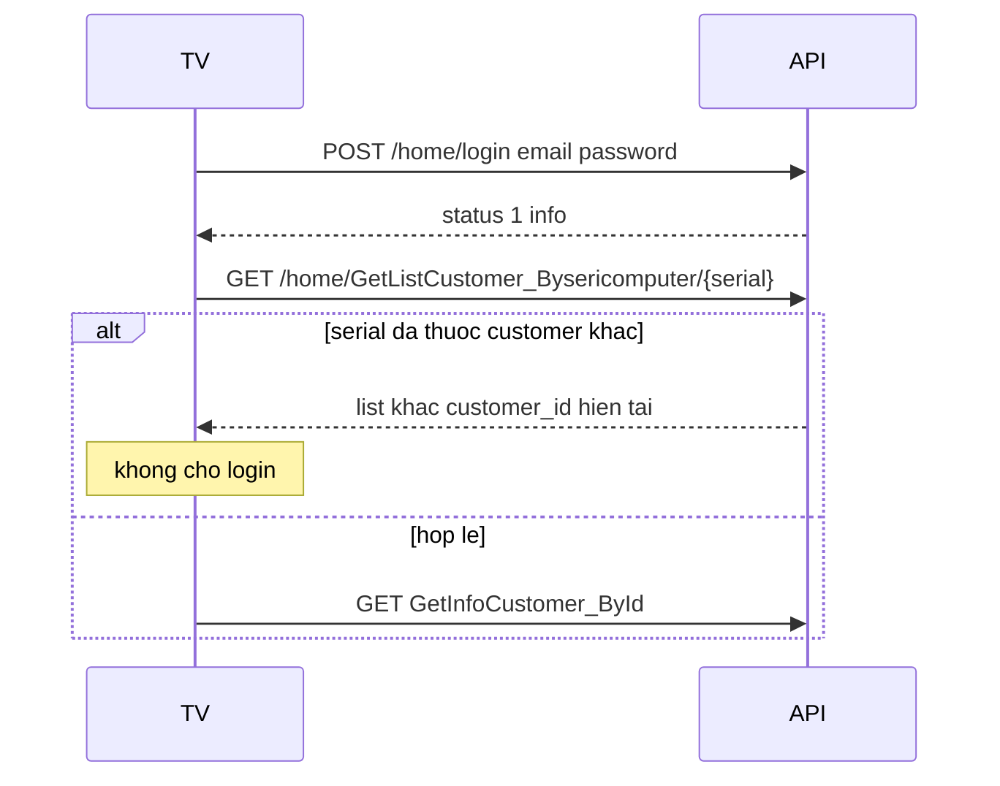
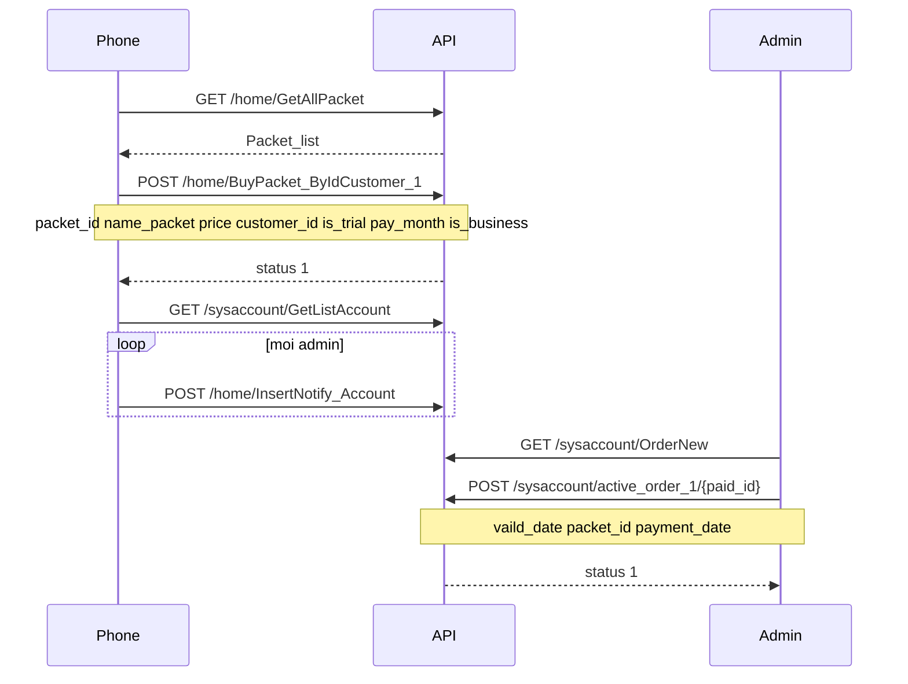
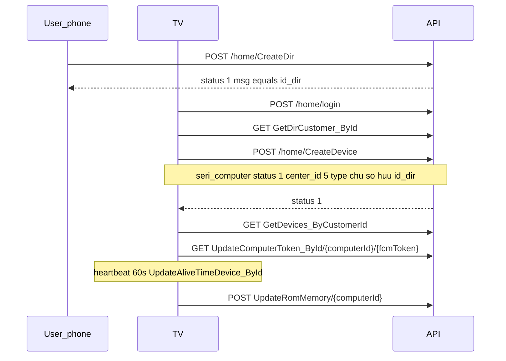
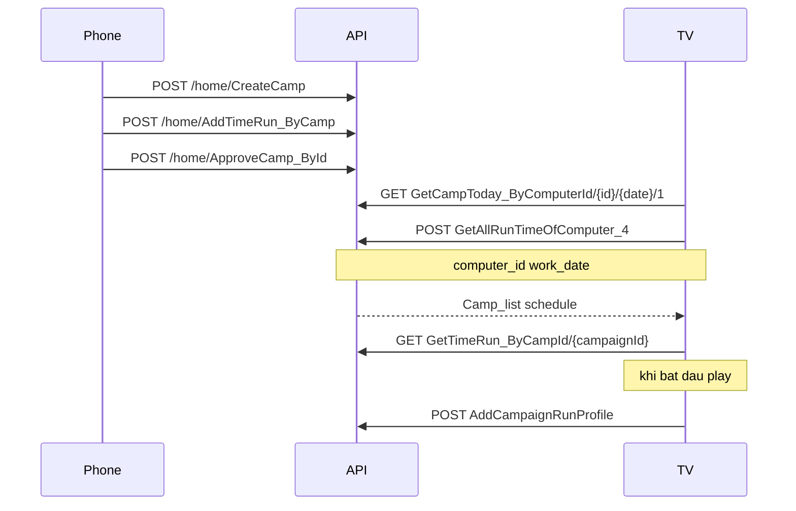
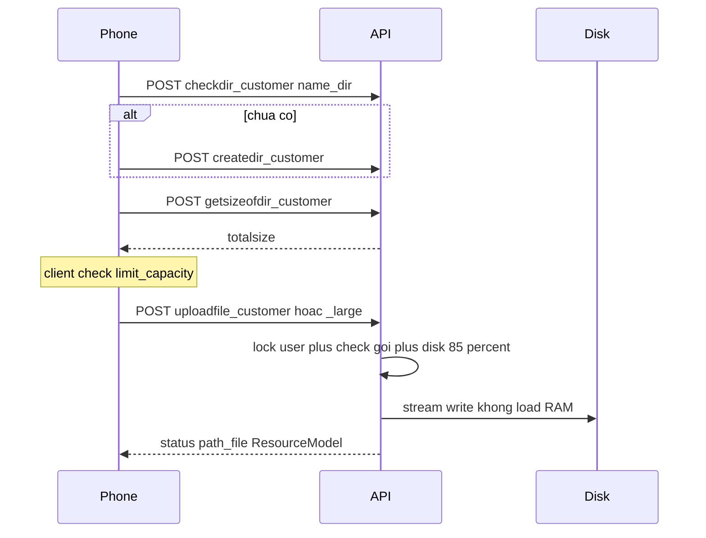
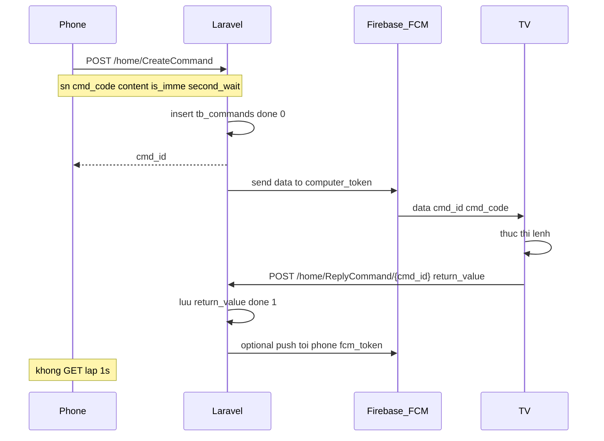

# TS Screen — Workflows theo phase

Nguồn sự thật. Rules: [`.agents/rules/`](rules/). Xong việc: ghi [`PROGRESS.md`](PROGRESS.md).

Backend Laravel giữ **đúng path/payload** 3 app Flutter hiện tại (`/home/*`, `/sysaccount/*`, `/vietQR/*`, `/config6789.php`). App nhận chuỗi JSON `text/html`; Swagger Try it out nhận `application/json`. `status = 1` thành công, `-2` hiện `msg`.

Bảng prefix `tb_*`. Media lưu disk local, quota theo gói.

---

## Nguyên tắc chia phase

- Mỗi phase ship được, Swagger cập nhật endpoint của phase đó.
- Phase sau phụ thuộc phase trước (auth → gói → thiết bị → campaign → media).
- **Gửi lệnh (remote control) không làm sớm.** Không thiết kế poll 5s/10s. Phase cuối: Laravel đẩy Firebase FCM.
- App TV cũ vẫn gọi `GetNewCommands` mỗi 10s khi FCM fail — backend **có endpoint** để app không gãy, nhưng **rate-limit + cache**, không khuyến khích poll. Phase lệnh mới: FCM từ server, TV tắt poll.

---

## Phase 0 — Nền tảng

**Mục tiêu:** Laravel nhận được request kiểu PHP cũ, Swagger chạy, bảng trống sẵn.

### Làm gì
- Helper `LegacyJson::send($array)` — app `text/html` JSON string; Swagger `application/json`.
- `routes/legacy.php` không CSRF, không prefix `/api`.
- Migrations `tb_*` (chưa cần logic đầy đủ).
- `GET /config6789.php`.
- l5-swagger tại `/api/documentation`.
- Queue worker (cleanup sau này). Disk watermark helper (dùng Phase 5).

### Workflow: app khởi động

**Config trả đủ 3 app**
- Chung: `COMPANY_NAME`, `COMPANY_ADDRESS`, `HOTLINE`, `REPRESENTATIVE`, `EMAIL`, `TAX_CODE`, `API_SERVER`, `GUIDE_LINK`, `ACTIVE_FLAG`, `show_payment`, `statement_date`
- Phone: `APPUSERANDROID_VERSION`, `APPUSERANDROID_BUILD_DATE`, `APPUSERANDROID_UPDATE_URL`, `APPUSERIOS_*`
- TV: `APPTVBOX_VERSION`, `APPTVBOX_BUILD_DATE`, `APPTVBOX_UPDATE_URL`
- Admin: `APPADMINANDROID_*`, `APPADMINIOS_*`

**Deploy:** trỏ `API_SERVER` trên domain cũ sang Laravel, hoặc host Laravel đúng URL app đang hardcode.

---

## Phase 1 — Auth (customer + admin)

**Bảng:** `tb_users`, `tb_accounts`, `tb_otp_codes`

### Quy ước mật khẩu
- Phone/TV customer: gửi **plaintext**.
- Google/Apple: login với **password rỗng** nếu email đã có user.
- Admin app + TV check admin: gửi **MD5 hex**.
- Server lưu **bcrypt** của chuỗi nhận được. JSON user vẫn có key `password` (phone lưu làm token) nhưng **không** trả hash.

`user_type` admin: `"1"` Super Admin, `"2"` Admin, `"3"` Member.

### Workflow: đăng ký / đăng nhập customer (phone)

Login: `POST /home/login` (`email`, `password`, `fcm_token`) → `{ status, msg, info: [User] }`.

Khác: `logout1`, `SendCode`, `resetpass` (`code_authen`), `changepass`, `DeleteUser1`, `UpdateInfoCustomer_ById`, `GetInfoCustomer_ByEmail`.

### Workflow: TV login + chặn thiết bị đã thuộc người khác

Google TV: `GetInfoCustomer_ByEmail` → nếu có user → `POST /home/login` password rỗng.

### Workflow: admin

- `POST /sysaccount/login` (`username`, `password` MD5, `fcm_token`) → `{ status, accountList }`
- `changepass`, `createaccount`, `SendCode`, `resetpass`
- `GET /sysaccount/GetListAccount` → `{ accountList }` (phone dùng để gửi notify admin)

---

## Phase 2 — Gói cước, đơn hàng, hạn mức

**Bảng:** `tb_packets`, `tb_orders`, `tb_transactions`

Nguồn sự thật hạn mức:
- `limit_qty` = số TV tối đa
- `limit_capacity` = tổng bytes media
- Giá `price` / `price_6_month` / `price_12_month`, `pay_month` = 1 | 6 | 12
- `is_trial`, `is_business`
- Order `pay`: `"0"` chưa active, `"1"` đã kích hoạt

### Workflow: mua gói (phone) → admin duyệt

Khác:
- Phone: `GetPacket_ByCustomerId`, `CancelPacket_ById`, `Get_Transactions_ByCustomerId`
- Phone VietQR: `POST /vietQR/getQRCode_ByPaidId` (`paid_id`) → `{ qrLink }` (chưa webhook; admin active tay)
- Admin: `GetAllOrder`, `order_endtime`, `detail_order/{paidId}`, `Filter_Packet`
- Admin packet CRUD: `CreatePacket`, `UpdatePacket_ById`, `DELETE DeletePacket_ById`
- Admin: `UpdateStatusCustomer` — UI bật `"1"` → API `"y"`, tắt → `"n"`

**Enforce server (bắt buộc)**
- Tạo device: số device owner `< limit_qty` của gói còn hạn (`valid_date < now < expire_date`, `pay=1`, `deleted != y`)
- Upload (Phase 5): `used_bytes + file <= limit_capacity`
- Hết hạn: không upload mới, không thêm TV; file cũ TV vẫn play

Gói hợp lệ TV: `GET GetPacket_ByCustomerId` — TV chỉ cần “có gói active”, không check số.

---

## Phase 3 — Thư mục thiết bị + pairing TV

**Bảng:** `tb_dirs`, `tb_dir_shares`, `tb_devices`, `tb_device_shares`

`tb_dirs` = nhóm thiết bị trên app. Folder media (`customer_token`) là Phase 5, khác dir này.

### Workflow: pairing

`CreateDevice` chỉ TV gọi. Serial = hardware serial; nếu `unknown` dùng `androidId`.

Phone: gán dir `UpDateDevice_ById`, xóa, share `InsertDeviceShare`, list external `GetDevicesNotBelongAnyDir_ByCustomerId`.

Share dir: `InsertDirShare` (`customer_idfrom`, `customer_idto`, `checkOwner`).

On/off theo dir: `UpDateOnOffDeviceDir_ById` (`turnon_time`, `turnoff_time`).

Heartbeat 60s **giữ** — 1 request/phút/máy, chấp nhận được. Không dùng interval này để lấy lệnh.

---

## Phase 4 — Campaign, lịch chạy, thống kê

**Bảng:** `tb_campaigns`, `tb_campaign_time_runs`, `tb_campaign_run_profiles`

`approved_yn`: `'0'` chờ, `'1'` duyệt, `'-1'` từ chối.

`video_type`: `url` | `usb` | `youtube`. URL remote: `url_youtobe`. USB: `url_usp`. Trailing `/1` trên TV = chỉ camp active. Ngày TV = UTC+7.

### Workflow: phone tạo camp → TV lịch trong ngày

TV đang gửi nhầm `computer_id` = `customer_id` ở run profile — backend map thêm `seri_computer`.

Phone thống kê: `GetCampaignRunProfile`, `GetCampaignRunProfile_Genaral`.

Endpoint ít dùng vẫn làm: `GetShareCamp_ByCustomerId`, `GetDefaultTimeRun_ByIdDir`, `Getcamp_ByComputerId`, `UpdateDefaultCamp_ById`, `UpdateRunByDefaultCamp_ById`.

**Chưa gửi lệnh `VIDEO_FROMCAMP` ở phase này** — TV tự load lịch. Lệnh push nằm Phase 7.

---

## Phase 5 — Media (video/ảnh) + chống tràn hosting

**Bảng:** `tb_resources`, `tb_upload_chunks`

Folder vật lý: `storage/app/public/uploads/{customer_token}/`. Path JSON: `./uploads/{customer_token}/file.mp4` (app `replaceFirst('.', hostApi)`).

App: file > 200MB → chunk 100MB `uploadfile_customer_large`; nhỏ hơn → `uploadfile_customer`.

### Workflow: upload có quota

**Bảo vệ server**
- Stream `UploadedFile`, không đọc cả file vào RAM
- Chunk: `{name}.part{n}` → assemble khi đủ `total_chunks`; `cancelUpload` xóa part
- Quota từ `tb_resources` (không scan disk mỗi request)
- Disk > 85% → reject mọi upload
- Tối đa 2 upload đồng thời / user; max 110MB / request
- Whitelist image jpeg/png/webp/gif, video mp4/mov/webm
- Queue xóa `.part*` > 24h
- Serve **HTTP Range** (TV seek). Nginx alias `public/uploads` tốt hơn PHP
- Không ffmpeg lúc upload

Xóa: `deletefile_customer` (`name_dir`, `name_file`). List: `getfiles_customer` → `file_list` (bỏ file `.part*`).

---

## Phase 6 — Thông báo in-app

**Bảng:** `tb_notifications` (`customer_id`), `tb_account_notifications` (`account_id`)

Typo giữ: `Nofity_list`, field `descript`.

| App | Endpoint |
|-----|----------|
| Phone | `GetNofity_ByIdCustomer`, `GetNofityNew_ByIdCustomer` → `{ count }`, `InsertNotify` |
| Admin | `GetNofity_ByIdAccount`, `GetNofityNew_ByIdAccount`, `InsertNotify` (đôi khi nhét `account_id` vào `customer_id`) |
| Cả hai | `GetNofity_ById`, `UpdateNotify/{id}` đánh dấu đọc |

Chưa đẩy FCM notify ở phase này (app tự nhận topic/token sẵn). Phase 7 mới dùng FCM cho **lệnh điều khiển**.

---

## Phase 7 — Lệnh điều khiển (sau, Firebase từ Laravel)

**Không làm poll định kỳ.** App TV cũ GET mỗi **10s** khi `isFirebase=false` — tốn connection, dễ sập khi nhiều máy. Phone hiện GET `GetInfoCommand_ByID` mỗi **1s** trong `secondWait` (mặc định 10s) — cũng bỏ ở hướng mới.

**Bảng:** `tb_commands`

### Vì sao không poll
- N máy × 6 request/phút (10s) chỉ để hỏi “có lệnh không”
- Phone × 10 GET/lệnh chờ reply
- Hosting PHP/Laravel chịu tải request rỗng, dễ timeout upload video cùng lúc

### Hướng đi: Laravel gửi FCM, TV/phone không poll

FCM **chuyển từ app** (service account trong APK — rủi ro) **sang server**. App sau này chỉ nhận push; không nhúng key Firebase.

`cmd_code` giữ nguyên app: `RESTART_APP`, `WAKE_UP_APP`, `GET_TIMENOW`, `DELETE_DEVICE`, `DELETE_USER`, `VIDEO_STOP`, `VIDEO_PAUSE`, `VIDEO_RESTART`, `VIDEO_FROMUSB`, `VIDEO_FROMCAMP`, `OPEN_YOUTUBE`, `OPEN_NETFLIX`, `OPEN_SPOTIFY`, `OPEN_TS_Screen`, `OPEN_FORTUNE_WHEEL`, `OPEN_VIEON`, `OPEN_TIKTOK`, `OPEN_HOME`, `RESTART_DEVICE`, `UPDATE_VERSION`.

`return_value`: `OK`, `NOT_PLAY`, `CONTINUE_VIDEO`, `PAUSE_VIDEO`, `APP_NOT_SHOW`, `APP_LOCK`, `APP_RUNNING`, `NOT_PERMISSION`, hoặc `HH:mm:ss`.

### Tương thích app chưa sửa (chỉ Phase 7, có kiểm soát)

Giữ endpoint, **cấm poll dày**:

| Endpoint | Dùng cho | Giới hạn backend |
|----------|----------|------------------|
| `POST /home/CreateCommand` | Phone/Admin tạo lệnh | Queue FCM; nếu chưa cấu hình FCM thì chỉ lưu DB |
| `POST /home/ReplyCommand/{id}` | TV trả kết quả | 1 lần / lệnh |
| `GET /home/GetInfoCommand_ByID/{id}` | Phone xem kết quả | Rate-limit **tối thiểu 3s/user**, không phải vòng 1s |
| `GET /home/GetNewCommands_BySeriComputer/{serial}` | TV Android cũ | Rate-limit **tối thiểu 30s/device**; trả `cmd_list` pending `done=0`. Không document “gọi 5s/10s” |
| `GET /home/UpdateComputerToken_ById/{id}/{token}` | Đăng ký FCM TV | Token rỗng = logout |

Khi FCM server bật: TV nhận push ngay; `GetNewCommands` chỉ còn **một lần lúc app resume** (sửa TV sau). Heartbeat 60s giữ nguyên, không dính lệnh.

### Việc làm lúc tới Phase 7
1. Service account Firebase **chỉ trên server** (`.env`), không trong APK.
2. Queue job `SendDeviceCommand` — retry FCM, không block HTTP CreateCommand.
3. TTL lệnh pending (ví dụ 2 phút) rồi `done=expired`.
4. Swagger mô tả FCM payload `{ cmd_id, cmd_code }`.
5. (Tuỳ chọn) sửa TV tắt `CHECK_COMMAND_INTERVAL`; phone bỏ `Timer.periodic 1s`.

**Phase 0–6 không implement FCM gửi lệnh.** Có thể tạo sẵn `tb_commands` migration từ Phase 0 để khỏi sửa schema sau.

---

## Phạm vi không làm

- Sửa 3 app Flutter ở phase đầu (trừ khi tới Phase 7 cần tắt poll).
- REST `/api/v1` mới, JWT.
- S3/R2 (đã chọn disk + quota).
- Lucky wheel Firestore; bank/activity log admin (chưa có API).
- Transcode video lúc upload.

---

## Thứ tự làm việc đề xuất

1. Phase 0 + 1 — nền + auth + Swagger (FE test login ngay)
2. Phase 2 — gói/đơn (admin kích hoạt)
3. Phase 3 — dir/device (TV gắn được máy)
4. Phase 4 — campaign (TV phát lịch)
5. Phase 5 — media (upload video an toàn)
6. Phase 6 — notify
7. Phase 7 — lệnh + Firebase server (khi bạn sẵn sàng key FCM)
