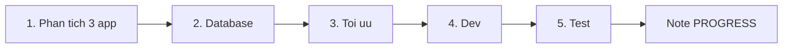

# TS Screen — Workflows xây dựng

Nguồn sự thật cách **làm từng module / API**. Backlog domain: [workflows/phases.md](workflows/phases.md). Rules: [rules/](rules/). Xong việc: [PROGRESS.md](PROGRESS.md).

**Cấm** viết controller/migration khi chưa xong cổng 1–3 của đúng module đó. Thiếu test (cổng 5) = việc chưa xong.

Chi tiết từng cổng: [01-analyze](workflows/01-analyze.md) · [02-database](workflows/02-database.md) · [03-optimize](workflows/03-optimize.md) · [04-dev](workflows/04-dev.md) · [05-test](workflows/05-test.md)

Skill: [skills/build-module/SKILL.md](skills/build-module/SKILL.md)

---

## Khi nào chạy pipeline

Mỗi lần thêm/sửa **một nhóm API cùng bảng** (ví dụ CreateDevice + GetDevices_ByCustomerId), hoặc **một endpoint** nếu nó độc lập. Phase 0–7 vẫn là thứ tự product; bên trong phase, từng cụm API đi đủ 5 cổng.

3 app (chỉ đọc, không sửa trừ Phase 7):

| App | Thư mục | Tag Swagger |
|-----|---------|-------------|
| Customer (Phone) | `RemoteProjector2024` | `Customer (Phone)` |
| Projector (TV) | `remote_projector_tv` | `Projector (TV)` |
| Admin | `RemoteProjectorAdmin` | `Admin` |

---

## Cổng 1 — Phân tích 3 app

Đọc **cả 3** app cho path đó, không đoán từ một app.

Bắt buộc mở:

- `**/constants/*api*.dart` — path, chữ hoa/thường
- `**/request/**/*.dart` — method GET/POST/DELETE, FormData keys, `jsonDecode` vs `response.data['key']`
- `**/models/**/*.dart` + `.g.dart` — key JSON, `.trim()` trên null, typo

Ghi **thẻ module** (template [templates/module-card.md](templates/module-card.md)): app nào gọi, field gửi/nhận, list key, status, typo, exception forceJson.

Không xong thẻ → không sang cổng 2.

---

## Cổng 2 — Database cho đúng thứ cần có

Chỉ cột **app đọc/ghi**. Prefix `tb_*`. PK integer, JSON trả string. Index theo lookup thật (`email`, `seri_computer`, `customer_id`, `paid_id`…).

- Cột đã có trong `database/migrations` / `database/sql/init_db_d26589bb.sql` → dùng lại, không tạo bảng song song.
- Thiếu cột so với model Flutter → migration mới + cập nhật file SQL hosting.
- Không thêm cột “phòng hờ” không có trong 3 app.

Không xong schema (hoặc xác nhận “không đổi DB”) → không sang cổng 3.

---

## Cổng 3 — Tối ưu

Trước khi code:

- Query: tránh N+1; list kèm `with()` đúng relation app cần
- Hạn mức: `PacketQuota` khi tạo device / upload — không tin check phía app
- Không poll 5s/10s; heartbeat 60s OK
- Upload: stream, quota DB, disk 85% (Phase 5)
- Rate-limit endpoint dễ bị spam (lệnh Phase 7)
- Response: đủ key app parse; `detail` không null nếu app `.trim()`

Không xong ghi chú tối ưu trên thẻ module → không sang cổng 4.

---

## Cổng 4 — Dev

- `routes/legacy.php`, middleware `api`, không CSRF, không prefix `/api`
- `LegacyJson::send`; `forceJson: true` khi app đọc Map không `jsonDecode`
- Swagger `AppTags` đúng app (dùng chung = nhiều tag)
- Enforce rule server (quota, serial đã thuộc người khác, pay=1…)

---

## Cổng 5 — Test

- `tests/Feature/...` khớp contract cổng 1 (status, list key, ID string, typo field)
- `php artisan test --filter=...` phải pass
- Swagger Try it out được (Referer documentation → JSON)

Thiếu test pass → không note “xong”, không sang API tiếp theo.

---

## Phase product (không thay pipeline)

0 Nền → 1 Auth → 2 Gói/đơn → 3 Dir/device → 4 Campaign → 5 Media → 6 Notify → **7 Lệnh DB (TV tự GET, Laravel không FCM)**

Chi tiết sequence từng phase: [workflows/phases.md](workflows/phases.md).
